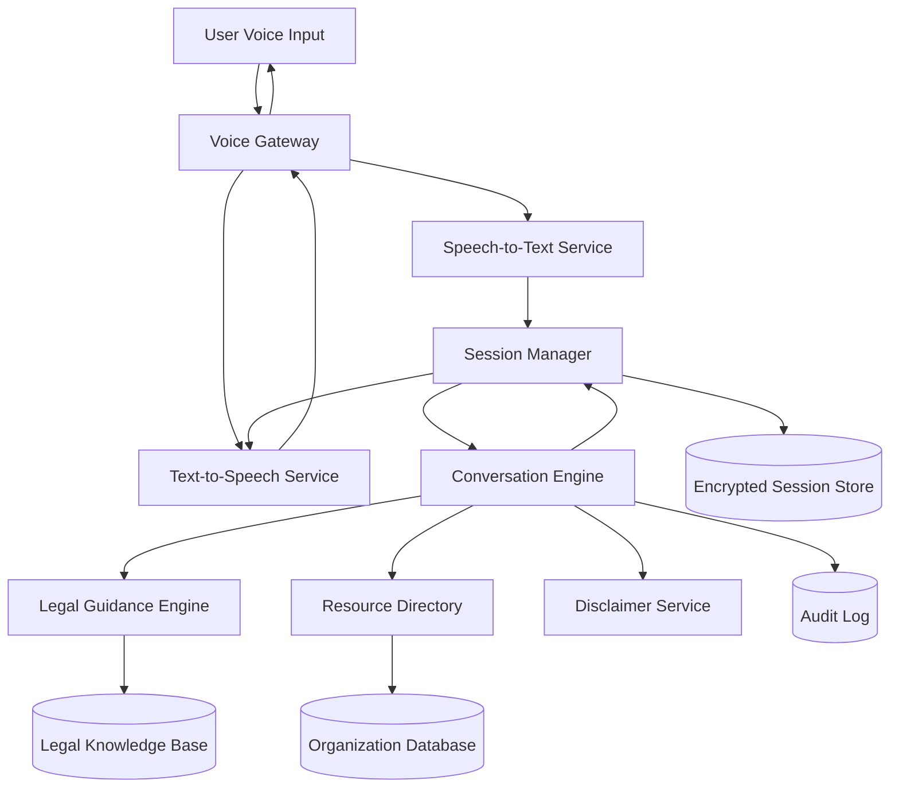

# Design Document: AI Legal Aid System

## Overview

The AI Legal Aid System is a voice-enabled application that provides first-level legal guidance to underserved populations. The system combines speech recognition, natural language processing, legal knowledge bases, and resource directories to deliver accessible legal information while maintaining clear boundaries about its limitations.

The architecture follows a microservices approach with distinct components for voice processing, legal reasoning, resource management, and user session handling. The system prioritizes accessibility, privacy, and reliability while ensuring users understand the distinction between AI guidance and professional legal counsel.

## Architecture

### High-Level Architecture



### Component Architecture

The system is organized into several key layers:

1. **Voice Interface Layer**: Handles speech recognition and synthesis
2. **Session Management Layer**: Manages user sessions and conversation state
3. **Legal Processing Layer**: Provides legal guidance and reasoning
4. **Resource Management Layer**: Manages legal aid organization data
5. **Data Layer**: Handles persistent storage with encryption

## Components and Interfaces

### Voice Interface Components

#### Speech-to-Text Service
- **Purpose**: Convert user voice input to text with high accuracy
- **Technology**: Cloud-based STT service (Google Speech-to-Text or Azure Speech Services)
- **Key Features**:
  - Multi-language support (English, Spanish)
  - Noise filtering and speaker focus
  - Confidence scoring for recognition quality
  - Real-time streaming recognition

**Interface**:
```typescript
interface SpeechToTextService {
  startListening(sessionId: string, language: string): Promise<void>
  stopListening(sessionId: string): Promise<string>
  onSpeechRecognized(callback: (text: string, confidence: number) => void): void
  onError(callback: (error: SpeechError) => void): void
}
```

#### Text-to-Speech Service
- **Purpose**: Convert system responses to natural-sounding speech
- **Technology**: Neural TTS with multiple voice options
- **Key Features**:
  - Natural prosody and intonation
  - Multi-language synthesis
  - Adjustable speech rate and volume
  - SSML support for emphasis and pauses

**Interface**:
```typescript
interface TextToSpeechService {
  synthesize(text: string, language: string, voice?: string): Promise<AudioBuffer>
  playAudio(audio: AudioBuffer): Promise<void>
  setVoiceSettings(rate: number, volume: number): void
}
```

### Session Management

#### Session Manager
- **Purpose**: Manage user sessions, conversation state, and data privacy
- **Key Features**:
  - Session lifecycle management
  - Conversation history tracking
  - Privacy-compliant data handling
  - Session timeout and cleanup

**Interface**:
```typescript
interface SessionManager {
  createSession(): Promise<SessionId>
  getSession(sessionId: SessionId): Promise<Session>
  updateSession(sessionId: SessionId, updates: Partial<Session>): Promise<void>
  endSession(sessionId: SessionId): Promise<void>
  cleanupExpiredSessions(): Promise<void>
}

interface Session {
  id: SessionId
  startTime: Date
  lastActivity: Date
  language: string
  conversationHistory: ConversationTurn[]
  userContext: UserContext
  disclaimerAcknowledged: boolean
}
```

### Legal Processing Components

#### Legal Guidance Engine
- **Purpose**: Process legal queries and provide appropriate guidance
- **Key Features**:
  - Legal issue classification
  - Context-aware guidance generation
  - Complexity assessment for referral decisions
  - Citation of relevant laws and regulations

**Interface**:
```typescript
interface LegalGuidanceEngine {
  classifyLegalIssue(query: string): Promise<LegalIssueType>
  generateGuidance(issue: LegalIssue, context: UserContext): Promise<LegalGuidance>
  assessComplexity(issue: LegalIssue): Promise<ComplexityLevel>
  getCitations(issue: LegalIssue): Promise<LegalCitation[]>
}

enum LegalIssueType {
  LAND_DISPUTE = "land_dispute",
  DOMESTIC_VIOLENCE = "domestic_violence", 
  WAGE_THEFT = "wage_theft",
  TENANT_RIGHTS = "tenant_rights",
  OTHER = "other"
}

interface LegalGuidance {
  summary: string
  detailedSteps: string[]
  urgencyLevel: UrgencyLevel
  recommendsProfessionalHelp: boolean
  applicableLaws: string[]
}
```

#### Conversation Engine
- **Purpose**: Orchestrate conversation flow and manage dialogue state
- **Key Features**:
  - Dialogue state tracking
  - Follow-up question generation
  - Context maintenance across turns
  - Integration with all system components

**Interface**:
```typescript
interface ConversationEngine {
  processUserInput(sessionId: SessionId, input: string): Promise<SystemResponse>
  generateFollowUpQuestions(context: ConversationContext): Promise<string[]>
  summarizeConversation(sessionId: SessionId): Promise<ConversationSummary>
  shouldEndConversation(context: ConversationContext): boolean
}

interface SystemResponse {
  text: string
  requiresDisclaimer: boolean
  suggestedActions: Action[]
  resources: ResourceReferral[]
  followUpQuestions?: string[]
}
```

### Resource Management

#### Resource Directory
- **Purpose**: Manage and query legal aid organizations and resources
- **Key Features**:
  - Geographic-based organization lookup
  - Specialization matching
  - Contact information management
  - Availability and hours tracking

**Interface**:
```typescript
interface ResourceDirectory {
  findOrganizations(criteria: SearchCriteria): Promise<LegalAidOrganization[]>
  getOrganizationDetails(orgId: string): Promise<LegalAidOrganization>
  updateOrganizationInfo(orgId: string, updates: Partial<LegalAidOrganization>): Promise<void>
  searchBySpecialization(issueType: LegalIssueType, location: Location): Promise<LegalAidOrganization[]>
}

interface LegalAidOrganization {
  id: string
  name: string
  contactInfo: ContactInfo
  specializations: LegalIssueType[]
  serviceArea: GeographicArea
  languages: string[]
  availability: OperatingHours
  eligibilityRequirements: string[]
}
```

### Disclaimer and Compliance

#### Disclaimer Service
- **Purpose**: Manage legal disclaimers and compliance requirements
- **Key Features**:
  - Context-appropriate disclaimer delivery
  - Acknowledgment tracking
  - Compliance audit trail
  - Multi-language disclaimer support

**Interface**:
```typescript
interface DisclaimerService {
  getInitialDisclaimer(language: string): Promise<string>
  getContextualDisclaimer(issueType: LegalIssueType, language: string): Promise<string>
  recordDisclaimerAcknowledgment(sessionId: SessionId, disclaimerType: string): Promise<void>
  shouldShowDisclaimer(context: ConversationContext): boolean
}
```

## Data Models

### Core Data Structures

```typescript
// User Context and Session Data
interface UserContext {
  location?: Location
  preferredLanguage: string
  legalIssueType?: LegalIssueType
  urgencyLevel?: UrgencyLevel
  hasMinorChildren?: boolean
  householdIncome?: IncomeRange
}

interface Location {
  state: string
  county?: string
  zipCode?: string
  coordinates?: {
    latitude: number
    longitude: number
  }
}

// Legal Issue Modeling
interface LegalIssue {
  type: LegalIssueType
  description: string
  urgency: UrgencyLevel
  complexity: ComplexityLevel
  involvedParties: string[]
  timeframe?: string
  documents?: DocumentType[]
}

enum UrgencyLevel {
  LOW = "low",
  MEDIUM = "medium", 
  HIGH = "high",
  EMERGENCY = "emergency"
}

enum ComplexityLevel {
  SIMPLE = "simple",
  MODERATE = "moderate",
  COMPLEX = "complex"
}

// Resource and Referral Data
interface ResourceReferral {
  organization: LegalAidOrganization
  relevanceScore: number
  contactMethod: ContactMethod
  nextSteps: string[]
  estimatedWaitTime?: string
}

interface ContactInfo {
  phone: string
  email?: string
  address: Address
  website?: string
  intakeHours: OperatingHours
}

// Conversation and Audit Data
interface ConversationTurn {
  timestamp: Date
  userInput: string
  systemResponse: SystemResponse
  confidence: number
  disclaimerShown: boolean
}

interface AuditRecord {
  sessionId: SessionId
  timestamp: Date
  action: string
  details: Record<string, any>
  complianceFlags: string[]
}
```

### Database Schema

The system uses a combination of relational and document storage:

**PostgreSQL Tables**:
- `legal_aid_organizations` - Organization master data
- `organization_specializations` - Many-to-many relationship
- `audit_logs` - Compliance and usage tracking
- `system_configuration` - Application settings

**Redis Cache**:
- Session data (encrypted, with TTL)
- Frequently accessed organization data
- Rate limiting counters

**Encrypted Document Store**:
- Conversation transcripts (anonymized)
- User feedback and ratings
- System performance metrics

## Correctness Properties

*A property is a characteristic or behavior that should hold true across all valid executions of a system—essentially, a formal statement about what the system should do. Properties serve as the bridge between human-readable specifications and machine-verifiable correctness guarantees.*

Now I need to analyze the acceptance criteria to determine which ones can be tested as properties. Let me use the prework tool to systematically evaluate each criterion.

### Property 1: Multi-language Voice Processing
*For any* supported language (English or Spanish), when a user provides voice input in that language, the system should correctly process the input and respond in the same language with appropriate cultural and linguistic context.
**Validates: Requirements 1.4, 7.1, 7.2**

### Property 2: Speech Recognition Accuracy and Error Handling
*For any* voice input with sufficient audio quality, the system should achieve at least 85% recognition accuracy, and for any failed recognition attempt, the system should prompt the user to repeat their input.
**Validates: Requirements 1.1, 1.5**

### Property 3: Noise Filtering and Speaker Focus
*For any* audio input containing background noise, the system should filter the noise and focus on the primary speaker's voice for processing.
**Validates: Requirements 1.3**

### Property 4: Legal Issue Classification and Response
*For any* legal query describing land disputes, domestic violence, wage theft, or tenant rights issues, the system should correctly classify the issue type and provide relevant, appropriate guidance including applicable laws and regulations.
**Validates: Requirements 2.1, 2.2, 2.3, 2.4, 2.6**

### Property 5: Clarification for Ambiguous Queries
*For any* unclear, ambiguous, or incomplete legal query, the system should ask appropriate clarifying questions rather than providing potentially incorrect guidance.
**Validates: Requirements 2.5, 7.5, 8.3**

### Property 6: Resource Referral Completeness and Prioritization
*For any* legal issue requiring professional assistance, the system should provide complete referral information (name, phone, address, hours) and prioritize organizations based on geographic proximity, specialization, and language services.
**Validates: Requirements 3.1, 3.2, 3.3, 3.4, 7.3**

### Property 7: Fallback Resource Provision
*For any* location where no local legal aid organizations are available, the system should provide national hotlines and online resources as alternatives.
**Validates: Requirements 3.5**

### Property 8: Comprehensive Disclaimer Management
*For any* user session, the system should present initial disclaimers, include disclaimers with all legal guidance, maintain records of disclaimer presentation, and provide stronger attorney recommendations for complex or urgent situations.
**Validates: Requirements 4.1, 4.2, 4.3, 4.5**

### Property 9: Legal Advice Boundary Enforcement
*For any* request for specific legal advice or personalized legal counsel, the system should clearly explain its limitations and redirect users to professional legal services.
**Validates: Requirements 4.4**

### Property 10: Data Protection and Privacy
*For any* user data (personal information, conversation logs, audio recordings), the system should encrypt data in transit and at rest, anonymize PII in stored logs, and securely delete temporary files after session completion.
**Validates: Requirements 5.1, 5.2, 5.3**

### Property 11: Data Deletion Capability
*For any* user request for data deletion, the system should provide functional data deletion options that completely remove user data from all storage systems.
**Validates: Requirements 5.5**

### Property 12: System Performance and Resilience
*For any* user query under normal load conditions, the system should respond within 10 seconds, and under high load conditions, should queue users with estimated wait times while maintaining core functionality during component failures.
**Validates: Requirements 6.2, 6.3, 6.5**

### Property 13: Structured Conversation Flow
*For any* new user session, the system should guide users through initial assessment, ask relevant follow-up questions based on issue type, and provide conversation summaries at appropriate points including session end.
**Validates: Requirements 8.1, 8.2, 8.4, 8.5**

## Error Handling

The system implements comprehensive error handling across all components:

### Voice Interface Error Handling
- **Speech Recognition Failures**: Graceful degradation with retry prompts and alternative input methods
- **Audio Quality Issues**: Automatic noise filtering with user feedback for poor audio conditions
- **Language Detection Errors**: Fallback to default language with user confirmation
- **TTS Failures**: Text-based fallback options for users with hearing impairments

### Legal Processing Error Handling
- **Unrecognized Legal Issues**: Graceful handling with general guidance and professional referral
- **Knowledge Base Unavailability**: Cached responses and basic guidance with clear limitations
- **Complex Query Processing**: Timeout handling with partial results and professional referral

### Resource Directory Error Handling
- **No Local Resources Found**: Automatic fallback to regional and national resources
- **Outdated Organization Information**: Clear indication of last update time and verification prompts
- **Service Unavailability**: Cached organization data with staleness indicators

### System-Level Error Handling
- **Component Failures**: Circuit breaker patterns with graceful degradation
- **Database Connectivity Issues**: Read-only mode with cached data
- **High Load Conditions**: Request queuing with transparent wait time communication
- **Security Violations**: Immediate session termination with audit logging

## Testing Strategy

The AI Legal Aid System requires a comprehensive testing approach that combines traditional unit testing with property-based testing to ensure correctness across the wide variety of legal scenarios and user interactions.

### Dual Testing Approach

**Unit Tests**: Focus on specific examples, edge cases, and integration points
- Specific legal scenario examples (sample land dispute, domestic violence case)
- Edge cases (empty input, extremely long queries, unsupported languages)
- Component integration testing (voice interface to legal engine)
- Error condition handling (network failures, service timeouts)
- Security boundary testing (data encryption, PII handling)

**Property Tests**: Verify universal properties across all possible inputs
- Voice recognition accuracy across generated speech samples
- Legal guidance appropriateness across randomized legal scenarios  
- Resource referral completeness across various geographic locations
- Disclaimer presentation consistency across all interaction patterns
- Data privacy compliance across all data handling operations

### Property-Based Testing Configuration

The system will use **Hypothesis** (Python) for property-based testing with the following configuration:
- **Minimum 100 iterations** per property test to ensure comprehensive input coverage
- **Custom generators** for legal scenarios, voice input, and user contexts
- **Shrinking strategies** to find minimal failing examples for debugging
- **Stateful testing** for conversation flow validation across multiple turns

Each property test must reference its corresponding design document property using this tag format:
**Feature: ai-legal-aid, Property {number}: {property_text}**

### Test Data and Generators

**Legal Scenario Generators**:
- Randomized legal issue descriptions across all supported categories
- Varying complexity levels and urgency indicators
- Geographic location variations for resource testing
- Multi-language input generation for internationalization testing

**Voice Input Simulation**:
- Synthetic speech generation with varying accents and dialects
- Background noise injection for noise filtering tests
- Audio quality variations for recognition accuracy testing
- Multi-language speech samples for language detection testing

**User Context Generators**:
- Randomized user demographics and locations
- Varying session lengths and interaction patterns
- Different device capabilities and accessibility needs
- Edge cases like extremely long or short sessions

### Integration and End-to-End Testing

**Conversation Flow Testing**:
- Complete user journey simulation from initial contact to resource referral
- Multi-turn conversation validation with state persistence
- Error recovery and graceful degradation scenarios
- Cross-component integration validation

**Performance and Load Testing**:
- Response time validation under various load conditions
- Concurrent user session handling
- Resource utilization monitoring during peak usage
- Failover and recovery testing for system resilience

### Compliance and Security Testing

**Privacy Compliance Testing**:
- PII detection and anonymization validation
- Data encryption verification in transit and at rest
- Session cleanup and data deletion verification
- Audit trail completeness and accuracy

**Legal Compliance Testing**:
- Disclaimer presentation and acknowledgment tracking
- Boundary enforcement for legal advice limitations
- Professional referral trigger validation
- Regulatory compliance verification for legal aid requirements

This comprehensive testing strategy ensures the AI Legal Aid System meets its reliability, accuracy, and compliance requirements while maintaining user trust and safety.