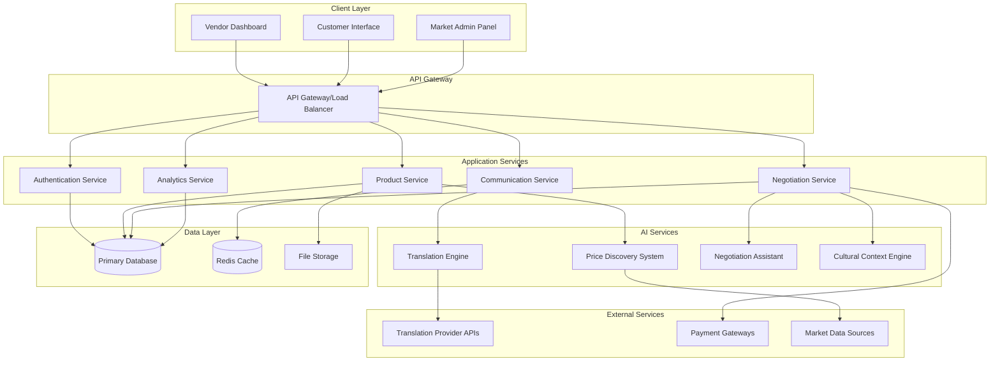

# Design Document: The Multilingual Mandi

## Overview

The Multilingual Mandi is a web-based platform that bridges language barriers in local trade through real-time AI-powered translation, intelligent price discovery, and culturally-aware negotiation assistance. The system architecture emphasizes real-time communication, scalable AI services, and responsive web interfaces to create seamless multilingual commerce experiences.

The platform serves three primary user types: local vendors managing their digital storefronts, customers browsing and negotiating across language barriers, and market administrators overseeing platform operations. The system integrates multiple AI services including neural machine translation, market analysis algorithms, and cultural context engines to facilitate fair and efficient trade.

## Architecture

### High-Level Architecture



### Technology Stack

**Frontend:**
- React.js with TypeScript for component-based UI development
- Material-UI or Tailwind CSS for responsive design system
- Socket.io-client for real-time communication with Python backend
- Progressive Web App (PWA) capabilities for mobile optimization

**Backend:**
- Python with FastAPI for high-performance async API services
- WebSockets with Python asyncio and websockets library for real-time communication
- JWT for authentication and session management using PyJWT
- Rate limiting with slowapi and request validation with Pydantic

**AI Integration:**
- Google Cloud Translation API or Azure Translator for neural machine translation
- scikit-learn and pandas for price analysis and market data processing
- Transformers library (Hugging Face) for advanced NLP and negotiation assistance
- TensorFlow or PyTorch for custom ML models and cultural context analysis

**Data Storage:**
- PostgreSQL for primary data storage with SQLAlchemy ORM
- Redis for session management and real-time data caching
- AWS S3 or Google Cloud Storage for media files
- Elasticsearch for product search and analytics

**Infrastructure:**
- Docker containers for service deployment
- Kubernetes for orchestration and scaling
- NGINX for reverse proxy and load balancing
- CloudFlare for CDN and DDoS protection

## Components and Interfaces

### Translation Engine

The Translation Engine provides real-time multilingual translation with context preservation and confidence scoring.

**Core Components:**
- **Translation Service**: Manages API calls to external translation providers
- **Context Analyzer**: Preserves commercial intent and cultural nuances
- **Confidence Scorer**: Evaluates translation quality and provides alternatives
- **Language Detector**: Automatically identifies source languages
- **Translation Cache**: Stores frequently used translations for performance

**Key Interfaces:**
```python
from pydantic import BaseModel
from typing import Optional, List
from enum import Enum

class TranslationContext(str, Enum):
    NEGOTIATION = "negotiation"
    PRODUCT_DESCRIPTION = "product_description"
    GENERAL = "general"

class TranslationRequest(BaseModel):
    text: str
    source_language: Optional[str] = None
    target_language: str
    context: TranslationContext
    user_id: str

class TranslationResponse(BaseModel):
    translated_text: str
    confidence: float
    alternatives: Optional[List[str]] = None
    detected_language: Optional[str] = None
    preserved_intent: bool
```

### Price Discovery System

The Price Discovery System analyzes market data to provide intelligent pricing recommendations with justification and confidence metrics.

**Core Components:**
- **Market Data Collector**: Aggregates pricing data from multiple sources
- **Price Analyzer**: Applies ML algorithms for price optimization
- **Trend Predictor**: Forecasts price movements based on historical data
- **Competitor Monitor**: Tracks competitive pricing in real-time
- **Confidence Calculator**: Evaluates recommendation reliability

**Key Interfaces:**
```python
from pydantic import BaseModel
from typing import List, Optional
from datetime import datetime

class CompetitorPrice(BaseModel):
    vendor_id: str
    price: float
    last_updated: datetime

class TrendData(BaseModel):
    direction: str  # "up", "down", "stable"
    percentage_change: float
    time_period: str

class PriceAnalysisRequest(BaseModel):
    product_id: str
    category: str
    location: str
    seasonality: Optional[bool] = None
    competitor_data: Optional[List[CompetitorPrice]] = None

class PriceRecommendation(BaseModel):
    suggested_price: float
    price_range: dict  # {"min": float, "max": float}
    confidence: float
    justification: List[str]
    market_trends: TrendData
    last_updated: datetime
```

### Real-time Communication System

The Communication System manages WebSocket connections for instant messaging, translation, and negotiation updates.

**Core Components:**
- **Connection Manager**: Handles WebSocket lifecycle and reconnection
- **Message Router**: Routes messages between users with translation
- **Presence Tracker**: Monitors user online status and activity
- **Message Queue**: Ensures reliable message delivery
- **Notification Service**: Sends push notifications for offline users

**Key Interfaces:**
```python
from pydantic import BaseModel
from typing import Optional
from datetime import datetime
from enum import Enum

class MessageType(str, Enum):
    TEXT = "text"
    OFFER = "offer"
    COUNTEROFFER = "counteroffer"
    SYSTEM = "system"

class NegotiationEventType(str, Enum):
    OFFER = "offer"
    COUNTEROFFER = "counteroffer"
    ACCEPT = "accept"
    REJECT = "reject"

class ChatMessage(BaseModel):
    id: str
    sender_id: str
    receiver_id: str
    original_text: str
    translated_text: Optional[str] = None
    timestamp: datetime
    message_type: MessageType

class NegotiationEvent(BaseModel):
    type: NegotiationEventType
    product_id: str
    amount: float
    terms: Optional[str] = None
    cultural_context: Optional[str] = None
```

### Negotiation Assistant

The Negotiation Assistant provides culturally-aware guidance and fair pricing evaluation during negotiations.

**Core Components:**
- **Cultural Context Engine**: Provides region-specific negotiation etiquette
- **Fairness Evaluator**: Assesses offer fairness against market rates
- **Strategy Advisor**: Suggests negotiation tactics and responses
- **History Analyzer**: Learns from past negotiations to improve suggestions
- **Compromise Generator**: Proposes win-win solutions for impasses

**Key Interfaces:**
```python
from pydantic import BaseModel
from typing import List

class UserProfile(BaseModel):
    id: str
    email: str
    role: str  # 'vendor', 'customer', 'admin'
    preferred_language: str
    location: dict  # GeographicLocation
    cultural_profile: dict  # CulturalContext
    verification_status: str  # 'pending', 'verified', 'rejected'
    created_at: datetime
    last_active: datetime

class CulturalContext(BaseModel):
    region: str
    negotiation_style: str  # 'direct', 'indirect', 'relationship_based'
    time_orientation: str  # 'punctual', 'flexible'
    communication_preferences: List[str]
    business_etiquette: List[str]
    holidays_and_events: List[str]

class NegotiationContext(BaseModel):
    participants: List[UserProfile]
    product_id: str
    current_offer: float
    market_price: float
    cultural_factors: CulturalContext
    negotiation_history: List[NegotiationEvent]

class NegotiationAdvice(BaseModel):
    suggested_response: str
    cultural_tips: List[str]
    fairness_score: float
    alternative_offers: List[float]
    reasoning: str
```

## Data Models

### User and Profile Models

```python
from pydantic import BaseModel
from typing import List, Optional
from datetime import datetime
from enum import Enum

class UserRole(str, Enum):
    VENDOR = "vendor"
    CUSTOMER = "customer"
    ADMIN = "admin"

class VerificationStatus(str, Enum):
    PENDING = "pending"
    VERIFIED = "verified"
    REJECTED = "rejected"

class GeographicLocation(BaseModel):
    country: str
    region: str
    city: str
    coordinates: Optional[dict] = None  # {"lat": float, "lng": float}
    timezone: str
    currency: str

class CulturalContext(BaseModel):
    region: str
    negotiation_style: str  # 'direct', 'indirect', 'relationship_based'
    time_orientation: str  # 'punctual', 'flexible'
    communication_preferences: List[str]
    business_etiquette: List[str]
    holidays_and_events: List[str]

class UserProfile(BaseModel):
    id: str
    email: str
    role: UserRole
    preferred_language: str
    location: GeographicLocation
    cultural_profile: CulturalContext
    verification_status: VerificationStatus
    created_at: datetime
    last_active: datetime

class PaymentMethod(BaseModel):
    type: str
    details: dict
    is_active: bool

class VendorProfile(UserProfile):
    business_name: str
    business_type: str
    market_stall: Optional[str] = None
    payment_methods: List[PaymentMethod]
    average_rating: float
    total_sales: int
    languages: List[str]
```

### Product and Inventory Models

```python
from typing import Dict, Any
from enum import Enum

class AvailabilityStatus(str, Enum):
    IN_STOCK = "in_stock"
    LOW_STOCK = "low_stock"
    OUT_OF_STOCK = "out_of_stock"

class TranslationSource(str, Enum):
    AI = "ai"
    HUMAN = "human"

class ProductTranslation(BaseModel):
    name: str
    description: str
    language: str
    translated_by: TranslationSource
    confidence: float

class Product(BaseModel):
    id: str
    vendor_id: str
    name: str
    description: str
    category: str
    base_price: float
    current_price: float
    currency: str
    images: List[str]
    availability: AvailabilityStatus
    specifications: Dict[str, Any]
    translations: Dict[str, ProductTranslation]
    created_at: datetime
    updated_at: datetime
```

### Transaction and Negotiation Models

```python
class NegotiationStatus(str, Enum):
    ACTIVE = "active"
    COMPLETED = "completed"
    CANCELLED = "cancelled"
    EXPIRED = "expired"

class TransactionStatus(str, Enum):
    PENDING = "pending"
    COMPLETED = "completed"
    FAILED = "failed"
    REFUNDED = "refunded"

class EscrowInfo(BaseModel):
    escrow_id: str
    amount: float
    release_conditions: List[str]
    dispute_resolution: Optional[str] = None

class Negotiation(BaseModel):
    id: str
    product_id: str
    vendor_id: str
    customer_id: str
    status: NegotiationStatus
    initial_price: float
    current_offer: float
    final_price: Optional[float] = None
    messages: List[ChatMessage]
    events: List[NegotiationEvent]
    cultural_context: CulturalContext
    started_at: datetime
    completed_at: Optional[datetime] = None

class Transaction(BaseModel):
    id: str
    negotiation_id: str
    amount: float
    currency: str
    payment_method: str
    status: TransactionStatus
    escrow_details: Optional[EscrowInfo] = None
    created_at: datetime
    completed_at: Optional[datetime] = None
```

### Cultural and Geographic Models

```python
class NegotiationStyle(str, Enum):
    DIRECT = "direct"
    INDIRECT = "indirect"
    RELATIONSHIP_BASED = "relationship_based"

class TimeOrientation(str, Enum):
    PUNCTUAL = "punctual"
    FLEXIBLE = "flexible"

class CulturalContext(BaseModel):
    region: str
    negotiation_style: NegotiationStyle
    time_orientation: TimeOrientation
    communication_preferences: List[str]
    business_etiquette: List[str]
    holidays_and_events: List[str]

class GeographicLocation(BaseModel):
    country: str
    region: str
    city: str
    coordinates: Optional[Dict[str, float]] = None  # {"lat": float, "lng": float}
    timezone: str
    currency: str
```

## Correctness Properties

*A property is a characteristic or behavior that should hold true across all valid executions of a system—essentially, a formal statement about what the system should do. Properties serve as the bridge between human-readable specifications and machine-verifiable correctness guarantees.*

### Translation Engine Properties

**Property 1: Translation Performance and Accuracy**
*For any* user message in a supported language, translation to any target language should complete within 2 seconds while preserving commercial intent and meaning
**Validates: Requirements 1.1, 1.2**

**Property 2: Translation Ambiguity Handling**
*For any* ambiguous message, the translation system should provide multiple alternatives with confidence scores to help users choose the most appropriate translation
**Validates: Requirements 1.3**

**Property 3: Speech-to-Translation Pipeline**
*For any* voice input, the system should successfully convert speech to text and then translate to the target language, maintaining the same quality standards as text translation
**Validates: Requirements 1.4**

**Property 4: Translation Error Recovery**
*For any* translation failure scenario, the system should gracefully degrade and notify both parties without breaking the communication flow
**Validates: Requirements 1.6**

### Price Discovery Properties

**Property 5: Price Analysis Performance**
*For any* new product addition, the price discovery system should analyze market data and provide price recommendations within 5 seconds, including justification based on comparable products and market factors
**Validates: Requirements 2.1, 2.3**

**Property 6: Market Responsiveness**
*For any* significant market condition change, the system should update affected price recommendations and notify relevant vendors automatically
**Validates: Requirements 2.2**

**Property 7: Historical Data Integrity**
*For any* pricing data point, the system should maintain accurate historical records that can be retrieved for trend analysis and future price predictions
**Validates: Requirements 2.4**

**Property 8: Low-Confidence Handling**
*For any* product with insufficient market data, the system should indicate low confidence in recommendations and suggest manual pricing approaches
**Validates: Requirements 2.5**

### Negotiation and Cultural Context Properties

**Property 9: Cultural Appropriateness**
*For any* negotiation between participants from different cultural backgrounds, the system should provide culturally appropriate guidance and opening suggestions based on their profiles
**Validates: Requirements 3.1, 3.3**

**Property 10: Fairness Evaluation**
*For any* counteroffer made during negotiation, the system should evaluate fairness against current market rates and provide appropriate response suggestions
**Validates: Requirements 3.2**

**Property 11: Impasse Resolution**
*For any* negotiation that reaches a deadlock, the system should suggest viable compromise solutions that consider both parties' positions and market conditions
**Validates: Requirements 3.4**

**Property 12: Learning from History**
*For any* completed negotiation, the system should incorporate the outcome data to improve future suggestions for similar scenarios
**Validates: Requirements 3.5**

### User Interface Properties

**Property 13: Vendor Dashboard Completeness**
*For any* vendor login, the dashboard should display all current inventory, active negotiations, and recent sales data accurately and completely
**Validates: Requirements 4.1**

**Property 14: Product Management Functionality**
*For any* product-related operation (add, update, bulk modify), the vendor dashboard should provide appropriate input validation, confirmation steps, and success feedback
**Validates: Requirements 4.2, 4.3**

**Property 15: Customer Search and Browse**
*For any* customer search query, the interface should return relevant products with accurate translations, current prices, and functional filtering options
**Validates: Requirements 5.1, 5.4**

**Property 16: Communication Integration**
*For any* customer-vendor interaction, the interface should provide seamless communication tools with real-time translation and cultural context
**Validates: Requirements 4.4, 5.2, 5.3**

**Property 17: Transaction Completion**
*For any* successful negotiation, the customer interface should facilitate secure transaction completion with appropriate payment options and confirmation
**Validates: Requirements 5.6**

### Responsive Design Properties

**Property 18: Device Adaptability**
*For any* device or screen size, the web interface should automatically adapt layout and functionality while maintaining full feature access
**Validates: Requirements 8.1**

**Property 19: Touch Interface Optimization**
*For any* touch-enabled device, the interface should provide appropriate touch targets, gesture support, and mobile-optimized interactions
**Validates: Requirements 8.2**

**Property 20: Network Resilience**
*For any* network condition (poor connectivity, intermittent connection), the interface should optimize data usage and provide offline capabilities where possible
**Validates: Requirements 8.3**

**Property 21: Cross-Browser Consistency**
*For any* major web browser, the interface should maintain consistent functionality and appearance across all supported platforms
**Validates: Requirements 8.4**

**Property 22: Accessibility Compliance**
*For any* accessibility need, the interface should support screen readers, keyboard navigation, and other assistive technologies
**Validates: Requirements 8.5**

### Payment System Properties

**Property 23: Localized Payment Options**
*For any* transaction initiation, the payment gateway should present locally relevant payment methods based on the user's geographic location
**Validates: Requirements 6.1**

**Property 24: Payment Processing Reliability**
*For any* payment transaction, the system should handle currency conversion correctly and provide clear confirmation or error messages
**Validates: Requirements 6.2, 6.3**

**Property 25: High-Value Transaction Support**
*For any* transaction above the escrow threshold, the payment system should automatically offer escrow services and dispute resolution tools
**Validates: Requirements 6.4, 6.5**

### Real-Time Communication Properties

**Property 26: Connection Performance**
*For any* online user, the communication system should establish real-time connections with sub-second latency and provide delivery confirmations
**Validates: Requirements 9.1, 9.2**

**Property 27: Message Reliability**
*For any* message sent during intermittent connectivity, the system should queue messages and deliver them when connection resumes
**Validates: Requirements 9.3**

**Property 28: Concurrent Communication**
*For any* user engaged in multiple conversations, the system should maintain separate conversation contexts without message cross-contamination
**Validates: Requirements 9.4**

**Property 29: Communication Security**
*For any* message transmitted through the system, end-to-end encryption should be applied to ensure privacy and security
**Validates: Requirements 9.6**

### Analytics and Reporting Properties

**Property 30: Analytics Completeness**
*For any* analytics request, the system should provide comprehensive price trends, demand patterns, and competitive analysis based on available market data
**Validates: Requirements 7.1**

**Property 31: Report Segmentation**
*For any* report generation request, the system should properly segment data by product category, time period, and geographic region as specified
**Validates: Requirements 7.2**

**Property 32: Anomaly Detection**
*For any* significant market anomaly, the analytics system should detect the deviation and alert relevant stakeholders automatically
**Validates: Requirements 7.3**

**Property 33: Data Privacy in Analytics**
*For any* aggregate report, the system should anonymize vendor-specific data to protect individual privacy while maintaining analytical value
**Validates: Requirements 7.5**

### Scalability Properties

**Property 34: Multi-Region Configuration**
*For any* new region added to the platform, the system should support independent market configurations and local customizations without affecting other regions
**Validates: Requirements 10.1**

**Property 35: Performance Consistency**
*For any* scaling operation, the platform should maintain consistent performance across all regions and user loads
**Validates: Requirements 10.2, 9.5**

**Property 36: Regional Compliance**
*For any* region with specific regulations, the platform should enforce local business rules and compliance requirements automatically
**Validates: Requirements 10.3**

**Property 37: Data Sovereignty**
*For any* regional data storage requirement, the system should store user and transaction data within appropriate geographic boundaries
**Validates: Requirements 10.5**

## Error Handling

### Translation Failures
- **Graceful Degradation**: When translation services are unavailable, the system falls back to showing original text with language indicators
- **Retry Logic**: Implement exponential backoff for temporary translation API failures
- **Alternative Providers**: Maintain backup translation services to ensure continuity
- **User Notification**: Clear messaging when translation quality may be compromised

### Price Discovery Errors
- **Data Insufficiency**: When market data is limited, clearly indicate low confidence and suggest manual pricing
- **API Failures**: Cache recent price recommendations to provide fallback suggestions
- **Calculation Errors**: Validate all price calculations and flag anomalous results for review
- **Market Volatility**: Detect and handle extreme price fluctuations with appropriate warnings

### Communication Failures
- **Connection Loss**: Queue messages locally and sync when connectivity returns
- **Message Delivery**: Implement delivery confirmations with retry mechanisms
- **Real-time Sync**: Handle WebSocket disconnections gracefully with automatic reconnection
- **Cross-Language Errors**: Provide fallback communication methods when translation fails

### Payment Processing Errors
- **Gateway Failures**: Support multiple payment providers with automatic failover
- **Currency Issues**: Handle currency conversion errors with clear user messaging
- **Transaction Disputes**: Provide comprehensive dispute resolution workflows
- **Security Breaches**: Implement fraud detection and immediate response protocols

### System-Wide Error Handling
- **Rate Limiting**: Implement fair usage policies with clear user feedback
- **Data Validation**: Comprehensive input validation at all system boundaries
- **Audit Logging**: Complete error tracking for debugging and compliance
- **Recovery Procedures**: Automated recovery for common failure scenarios

## Testing Strategy

### Dual Testing Approach

The testing strategy employs both unit testing and property-based testing to ensure comprehensive coverage:

**Unit Tests** focus on:
- Specific examples and edge cases
- Integration points between components
- Error conditions and boundary cases
- Cultural context accuracy for specific scenarios
- Payment gateway integration with specific providers

**Property-Based Tests** focus on:
- Universal properties that hold for all inputs
- Comprehensive input coverage through randomization
- Translation accuracy across language pairs
- Price discovery correctness across market conditions
- Communication reliability under various network conditions

### Property-Based Testing Configuration

**Testing Framework**: Hypothesis (Python) for property-based testing
**Test Iterations**: Minimum 100 iterations per property test to ensure statistical confidence
**Test Tagging**: Each property test tagged with format: **Feature: multilingual-mandi, Property {number}: {property_text}**

**Example Property Test Structure**:
```python
from hypothesis import given, strategies as st
import pytest
from datetime import datetime

# Feature: multilingual-mandi, Property 1: Translation Performance and Accuracy
@given(st.builds(
    dict,
    message=st.text(min_size=1, max_size=500),
    source_language=st.sampled_from(['en', 'es', 'fr', 'de', 'zh']),
    target_language=st.sampled_from(['en', 'es', 'fr', 'de', 'zh'])
))
@pytest.mark.asyncio
async def test_translation_performance_and_accuracy(translation_data):
    start_time = datetime.now()
    
    result = await translation_engine.translate(
        TranslationRequest(
            text=translation_data['message'],
            source_language=translation_data['source_language'],
            target_language=translation_data['target_language'],
            context=TranslationContext.NEGOTIATION,
            user_id="test_user"
        )
    )
    
    duration = (datetime.now() - start_time).total_seconds()
    
    assert duration < 2.0
    assert result.translated_text
    assert result.preserved_intent is True
```

### Integration Testing

**API Testing**: Comprehensive testing of all REST endpoints and WebSocket connections
**Cross-Browser Testing**: Automated testing across Chrome, Firefox, Safari, and Edge
**Mobile Testing**: Responsive design testing across various device sizes and orientations
**Performance Testing**: Load testing for concurrent users and high-volume transactions
**Security Testing**: Penetration testing for authentication, authorization, and data protection

### Cultural Context Testing

**Cultural Accuracy**: Manual review of cultural suggestions by native speakers
**Negotiation Scenarios**: Role-playing tests with users from different cultural backgrounds
**Translation Quality**: Human evaluation of AI translations for cultural appropriateness
**Regional Compliance**: Legal review of regional business rule implementations

### Continuous Testing

**Automated Test Suite**: Run on every code commit and deployment using pytest
**Monitoring and Alerting**: Real-time monitoring of system properties in production
**A/B Testing**: Gradual rollout of new features with performance comparison
**User Feedback Integration**: Continuous improvement based on user experience data