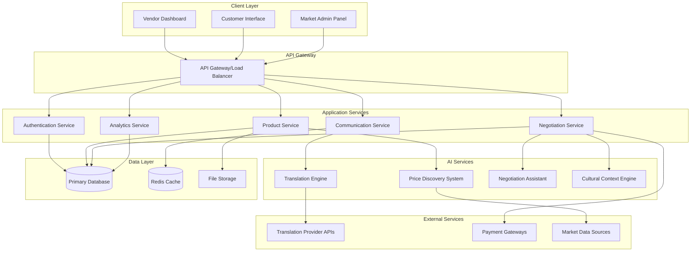

# Design Document: The Multilingual Mandi

## Overview

The Multilingual Mandi is a web-based platform that bridges language barriers in local trade through real-time AI-powered translation, intelligent price discovery, and culturally-aware negotiation assistance. The system architecture emphasizes real-time communication, scalable AI services, and responsive web interfaces to create seamless multilingual commerce experiences.

The platform serves three primary user types: local vendors managing their digital storefronts, customers browsing and negotiating across language barriers, and market administrators overseeing platform operations. The system integrates multiple AI services including neural machine translation, market analysis algorithms, and cultural context engines to facilitate fair and efficient trade.

## Architecture

### High-Level Architecture



### Technology Stack

**Frontend:**
- React.js with TypeScript for component-based UI development
- Material-UI or Tailwind CSS for responsive design system
- Socket.io-client for real-time communication
- Progressive Web App (PWA) capabilities for mobile optimization

**Backend:**
- Node.js with Express.js for API services
- Socket.io for WebSocket management
- JWT for authentication and session management
- Rate limiting and request validation middleware

**AI Integration:**
- Google Cloud Translation API or Azure Translator for neural machine translation
- Custom ML models for price analysis and cultural context
- OpenAI GPT-4 or similar for negotiation assistance
- TensorFlow.js for client-side AI features

**Data Storage:**
- PostgreSQL for primary data storage with JSONB support
- Redis for session management and real-time data caching
- AWS S3 or Google Cloud Storage for media files
- Elasticsearch for product search and analytics

**Infrastructure:**
- Docker containers for service deployment
- Kubernetes for orchestration and scaling
- NGINX for reverse proxy and load balancing
- CloudFlare for CDN and DDoS protection

## Components and Interfaces

### Translation Engine

The Translation Engine provides real-time multilingual translation with context preservation and confidence scoring.

**Core Components:**
- **Translation Service**: Manages API calls to external translation providers
- **Context Analyzer**: Preserves commercial intent and cultural nuances
- **Confidence Scorer**: Evaluates translation quality and provides alternatives
- **Language Detector**: Automatically identifies source languages
- **Translation Cache**: Stores frequently used translations for performance

**Key Interfaces:**
```typescript
interface TranslationRequest {
  text: string;
  sourceLanguage?: string;
  targetLanguage: string;
  context: 'negotiation' | 'product_description' | 'general';
  userId: string;
}

interface TranslationResponse {
  translatedText: string;
  confidence: number;
  alternatives?: string[];
  detectedLanguage?: string;
  preservedIntent: boolean;
}
```

### Price Discovery System

The Price Discovery System analyzes market data to provide intelligent pricing recommendations with justification and confidence metrics.

**Core Components:**
- **Market Data Collector**: Aggregates pricing data from multiple sources
- **Price Analyzer**: Applies ML algorithms for price optimization
- **Trend Predictor**: Forecasts price movements based on historical data
- **Competitor Monitor**: Tracks competitive pricing in real-time
- **Confidence Calculator**: Evaluates recommendation reliability

**Key Interfaces:**
```typescript
interface PriceAnalysisRequest {
  productId: string;
  category: string;
  location: string;
  seasonality?: boolean;
  competitorData?: CompetitorPrice[];
}

interface PriceRecommendation {
  suggestedPrice: number;
  priceRange: { min: number; max: number };
  confidence: number;
  justification: string[];
  marketTrends: TrendData;
  lastUpdated: Date;
}
```

### Real-time Communication System

The Communication System manages WebSocket connections for instant messaging, translation, and negotiation updates.

**Core Components:**
- **Connection Manager**: Handles WebSocket lifecycle and reconnection
- **Message Router**: Routes messages between users with translation
- **Presence Tracker**: Monitors user online status and activity
- **Message Queue**: Ensures reliable message delivery
- **Notification Service**: Sends push notifications for offline users

**Key Interfaces:**
```typescript
interface ChatMessage {
  id: string;
  senderId: string;
  receiverId: string;
  originalText: string;
  translatedText?: string;
  timestamp: Date;
  messageType: 'text' | 'offer' | 'counteroffer' | 'system';
}

interface NegotiationEvent {
  type: 'offer' | 'counteroffer' | 'accept' | 'reject';
  productId: string;
  amount: number;
  terms?: string;
  culturalContext?: string;
}
```

### Negotiation Assistant

The Negotiation Assistant provides culturally-aware guidance and fair pricing evaluation during negotiations.

**Core Components:**
- **Cultural Context Engine**: Provides region-specific negotiation etiquette
- **Fairness Evaluator**: Assesses offer fairness against market rates
- **Strategy Advisor**: Suggests negotiation tactics and responses
- **History Analyzer**: Learns from past negotiations to improve suggestions
- **Compromise Generator**: Proposes win-win solutions for impasses

**Key Interfaces:**
```typescript
interface NegotiationContext {
  participants: UserProfile[];
  productId: string;
  currentOffer: number;
  marketPrice: number;
  culturalFactors: CulturalContext;
  negotiationHistory: NegotiationEvent[];
}

interface NegotiationAdvice {
  suggestedResponse: string;
  culturalTips: string[];
  fairnessScore: number;
  alternativeOffers: number[];
  reasoning: string;
}
```

## Data Models

### User and Profile Models

```typescript
interface UserProfile {
  id: string;
  email: string;
  role: 'vendor' | 'customer' | 'admin';
  preferredLanguage: string;
  location: GeographicLocation;
  culturalProfile: CulturalContext;
  verificationStatus: 'pending' | 'verified' | 'rejected';
  createdAt: Date;
  lastActive: Date;
}

interface VendorProfile extends UserProfile {
  businessName: string;
  businessType: string;
  marketStall?: string;
  paymentMethods: PaymentMethod[];
  averageRating: number;
  totalSales: number;
  languages: string[];
}
```

### Product and Inventory Models

```typescript
interface Product {
  id: string;
  vendorId: string;
  name: string;
  description: string;
  category: string;
  basePrice: number;
  currentPrice: number;
  currency: string;
  images: string[];
  availability: 'in_stock' | 'low_stock' | 'out_of_stock';
  specifications: Record<string, any>;
  translations: Record<string, ProductTranslation>;
  createdAt: Date;
  updatedAt: Date;
}

interface ProductTranslation {
  name: string;
  description: string;
  language: string;
  translatedBy: 'ai' | 'human';
  confidence: number;
}
```

### Transaction and Negotiation Models

```typescript
interface Negotiation {
  id: string;
  productId: string;
  vendorId: string;
  customerId: string;
  status: 'active' | 'completed' | 'cancelled' | 'expired';
  initialPrice: number;
  currentOffer: number;
  finalPrice?: number;
  messages: ChatMessage[];
  events: NegotiationEvent[];
  culturalContext: CulturalContext;
  startedAt: Date;
  completedAt?: Date;
}

interface Transaction {
  id: string;
  negotiationId: string;
  amount: number;
  currency: string;
  paymentMethod: string;
  status: 'pending' | 'completed' | 'failed' | 'refunded';
  escrowDetails?: EscrowInfo;
  createdAt: Date;
  completedAt?: Date;
}
```

### Cultural and Geographic Models

```typescript
interface CulturalContext {
  region: string;
  negotiationStyle: 'direct' | 'indirect' | 'relationship_based';
  timeOrientation: 'punctual' | 'flexible';
  communicationPreferences: string[];
  businessEtiquette: string[];
  holidaysAndEvents: string[];
}

interface GeographicLocation {
  country: string;
  region: string;
  city: string;
  coordinates?: { lat: number; lng: number };
  timezone: string;
  currency: string;
}
```