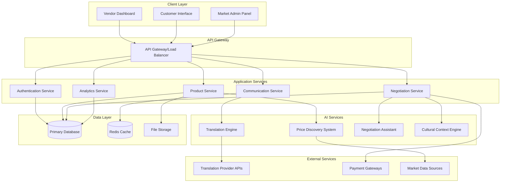

# The Multilingual Mandi

## Overview

The Multilingual Mandi is a web-based platform that bridges language barriers in local trade through real-time AI-powered translation, intelligent price discovery, and culturally-aware negotiation assistance. The system architecture emphasizes real-time communication, scalable AI services, and responsive web interfaces to create seamless multilingual commerce experiences.

The platform serves three primary user types: local vendors managing their digital storefronts, customers browsing and negotiating across language barriers, and market administrators overseeing platform operations. The system integrates multiple AI services including neural machine translation, market analysis algorithms, and cultural context engines to facilitate fair and efficient trade.

## Architecture

### High-Level Architecture

